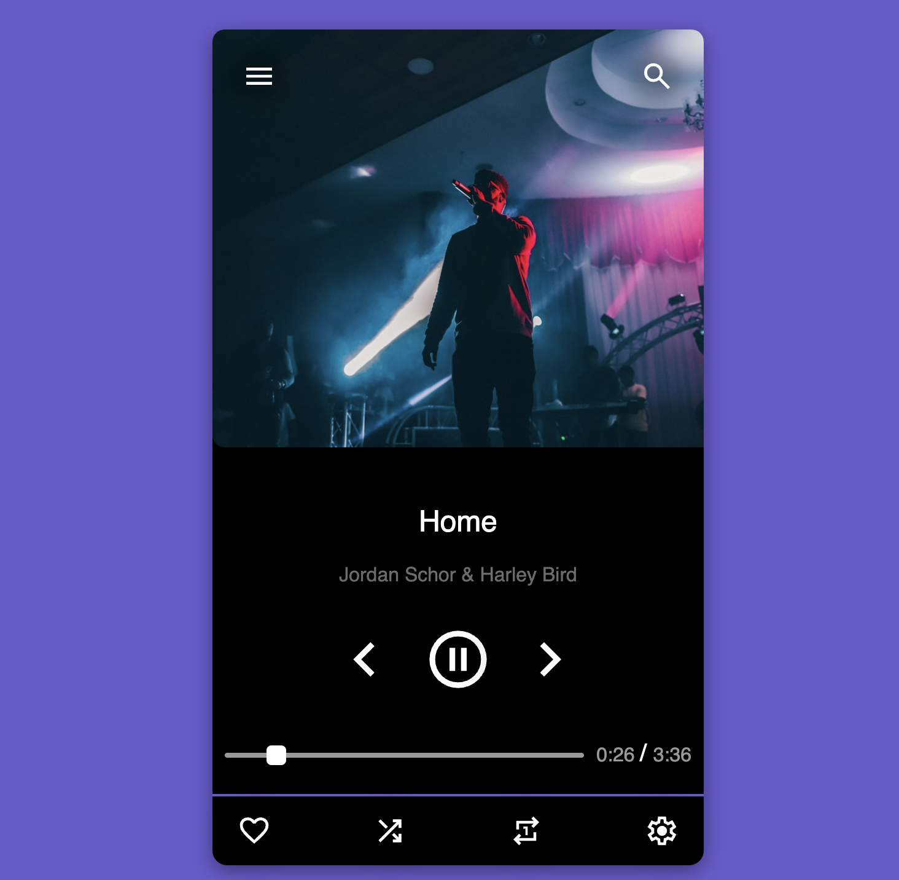
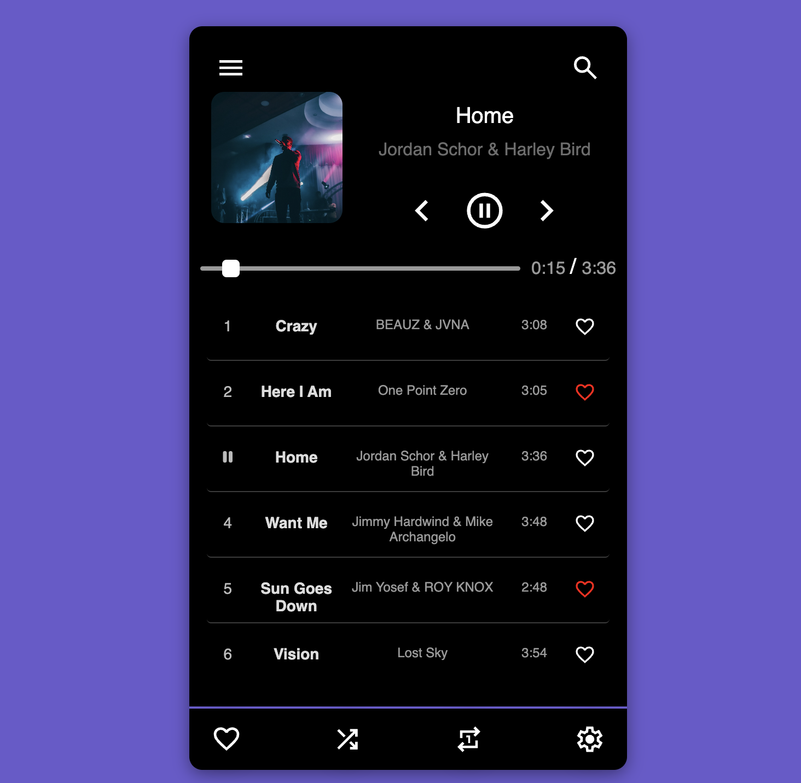
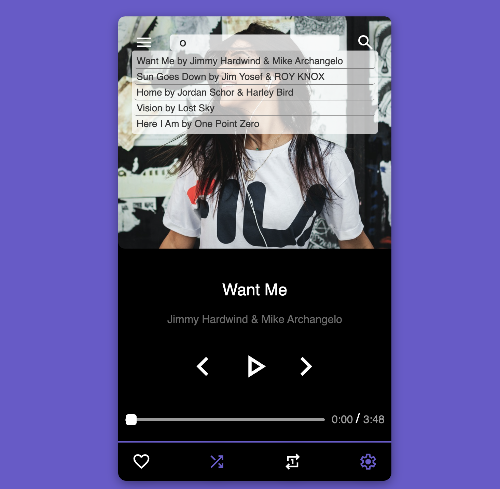
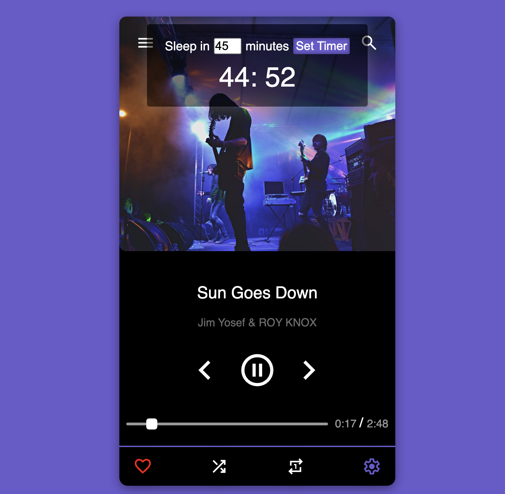

# Music App
## Frontend-Projekt mit TypeScript (Teamprojekt)

## Features

- Songs abspielen, pausieren und zum vorherigen/nächsten Titel springen  
- Songs als Favoriten speichern  
- Nach Titel oder Interpret suchen  
- Playlist anzeigen und verwalten  
- Shuffle-Modus für zufällige Wiedergabe  
- Sleep-Timer für automatische Beendigung der Wiedergabe  

## Unser Team

- Dursel Türkan  
- Angelique Guisse  
- Jing Li  

## Über das Projekt

Dieses Projekt haben wir gemeinsam nach dem Frontend-Modul im DCI-Kurs entwickelt. Unser Ziel war es, unsere Kenntnisse in **JavaScript, CSS und HTML** zu vertiefen. Statt JavaScript haben wir bewusst **TypeScript** gewählt, da es eine zentrale Rolle in der modernen Webentwicklung spielt. Dadurch möchten wir uns optimal auf den Arbeitsmarkt vorbereiten und wertvolle praktische Erfahrungen mit TypeScript sammeln.  

Unser Anspruch war es nicht nur, das Gelernte anzuwenden, sondern uns auch selbst herauszufordern. Obwohl TypeScript nicht Teil des Curriculums war, haben wir unser Projekt damit umgesetzt, um neue Erfahrungen in der **Frontend-Entwicklung** zu gewinnen.  

## Technologien

- TypeScript  
- CSS  
- HTML  

## Preview

🎉 Viel Spaß beim Entdecken und Ausprobieren!
